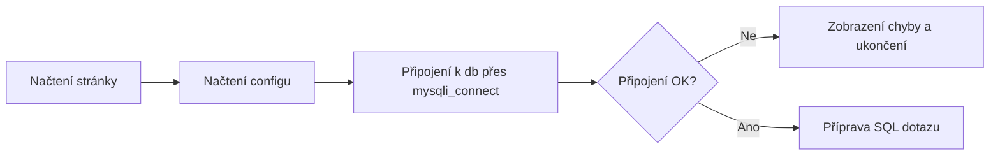
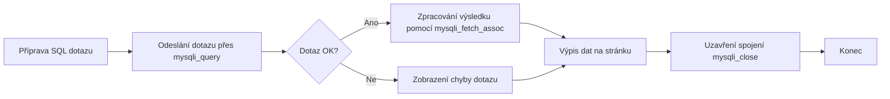

---
#== Layout
theme: default
background: https://cover.sli.dev # https://unsplash.com/collections/94734566/slidev
transition: slide-left #https://sli.dev/guide/animations#slide-transitions
mdc: true # https://sli.dev/guide/syntax#mdc-syntax
selectable: false
codeCopy: false
download: true
hideInToc: true

#== Code Highlighter
highlighter: shiki
lineNumbers: true

#== Dravings https://sli.dev/guide/drawing
drawings:
  persist: false

#== Export Configuration
# use export CLI options in camelCase format https://sli.dev/guide/exporting.html
export:
  format: pdf
  timeout: 30000
  dark: false
  withClicks: false

#== Slide Info
src: '../../pages/index.md'
title: "Databáze SQL vs PHP"
exportFilename: "21_DB_SQLvsPHP"
titleTemplate: "PVA4 %s by Adam Fišer"
info: |
  ## PVA4 Programování a vývoj aplikací

  Určeno pouze pro výukové účely

  [Repository](https://github.com/OA-PVA4-Syllabus/pva4_prednasky) / [Prezentace](https://oa-pva4-syllabus.github.io/pva4_prednasky/)

  Created by [Adam Fišer](https://github.com/AdamFiser)
---
layout: default
---

#  Obsah

<Toc :columns="2" minDepth="1" maxDepth="1"></Toc>
---

# Cíle hodiny

- vysvětlit, **jak spolu PHP a MySQL spolupracují**,
- vytvořit jednoduché **připojení k databází** v PHP,
- spustit v PHP **SQL dotaz (SELECT, INSERT)**,
- vypsat data z databáze do **stránky**,
- uvědomit si **základní bezpečnostní riziko (SQL injection)**.

---

# Jak typicky vypadá stránka s databází?

<v-click>

## Připojení k DB

</v-click>


<v-click>

## Zpracování dotazu

</v-click>

---

# Připojení k databázovému serveru

- Pro práci s databází je potřeba se připojit k databázovému serveru
- K tomu slouží knihovna `mysqli` (MySQL Improved) 
- Knihovna `mysqli` je součástí PHP od verze 5.0
- Knihovna `mysqli` je založena na starší knihovně `mysql`, která je již zastaralá a nepoužívá se!
- Podpora procedurálního a objektově orientovaného přístupu

```php
// Soubor config.php – údaje pro připojení (lokální / test / produkce)

// Připojení k databázi
// Údaje ukládáme do samostatného souboru dle přostředí (lokální, testovací, produkční)
$servername = "localhost"; //adresa sql serveru poskytovatele
$username   = "uzivatelskeJmeno";
$password   = "tajne*heslo";
$database   = "nazevDatabaze";
```

> Nikdy neukládat citlivé údaje veřejně do repositáře!


---
layout: image-right
image: https://cover.sli.dev
---

# Procedurální přístup

---

# Připojení k databázi `mysqli_connect()`

<!-- 
My budeme používat procedurální přístup, objektový se naučíme později až budeme probírat OOP.
-->

```php
// Vytvoření spojení na databázi
// common.php
require_once("config.php");

$conn = mysqli_connect($servername, $username, $password, $database);
```

...

```php
// Uzavření spojení na databázi
mysqli_close($conn);
```

---

# Ověření připojení k databázi

Na produkci chyby nezobrazujeme uživatelům, ale logujeme je do souboru / monitoringu.

```php
if (!$conn) {
    // Pokud spojení selže
    // zobrazí chybovou hlášku (pouze pro vývojové účely). Na produkci chyby nikdy nezobrazujeme!
    die("Připojení na databázi selhalo: " . mysqli_connect_error());
}
echo "Připojení na databázi bylo úspěšné!";
```

---

# Dotazy na databázi

```php
// Dotaz na databázový server
$sql = "SELECT sloupec, druhySloupec FROM tabulka";

// Výsledek dotazu uložíme do proměnné $result
$result = mysqli_query($conn, $sql);
```

`mysqli_query($conn, $sql)` - pošle dotaz na databázi,
vrátí výsledek dotazu (množinu řádků) nebo false při chybě.

---

# Zpracování výsledků

- `mysqli_num_rows()` - Výpočet počtu řádků výsledku
```php
mysqli_num_rows($result);
```

<v-click>

- `mysqli_fetch_row()` - Výsledky v podobě pole s číselnými indexy
```php
$row = mysqli_fetch_row($result);
```

</v-click>

<v-click>

- `mysqli_fetch_assoc()` - Výsledky v podobě asociativního pole
```php
// Výpis všech řádků výsledku
while($row = mysqli_fetch_assoc($result)) {
    // $row obsahuje asociativní pole s daty odpovídajícímu jednomu řádku výsledku
    // název indexu odpovídá názvu sloupce tabulky $row["sloupecTabulky"]
    echo "ID: " . $row["id"]. " - Jméno: " . $row["jmeno"]. "<br>";
}
```

</v-click>


<!--
Všechny řádky vstupu
- konfigurace údajů
- připojení na db
- sql dotaz a jeho zpracování db
- zpracování výsledků ve formě řádků
- ošetříme situaci, kdy není žádný výsledek
- uzavření spojení

-->

---

# Vkládání dat do databáze

```php
$jmeno = "Nový uživatel";
$email = "novy@example.com";

$sql = "
    INSERT INTO uzivatele (jmeno, email)
    VALUES ('$jmeno', '$email')
";

$result = mysqli_query($conn, $sql);

if ($result) {
    echo "Uživatel byl úspěšně vložen.";
} else {
    echo "Chyba při vkládání: " . mysqli_error($conn);
}
```

> Později si ukážeme bezpečnější způsob pomocí tzv. prepared statements.

---

# Příklad


```php {1-5|7-8|10-12|14-20|10-20|22-23|all}
// Soubor config.php
$servername = "localhost"; //adresa sql serveru poskytovatele
$username 	= "uzivatelskeJmeno";
$password 	= "tajne*heslo";
$database	= "nazevDatabaze";

// Soubor common.php
$conn = mysqli_connect($servername, $username, $password, $database);

// Zpracování dotazu
$sql = "SELECT id, jmeno FROM uzivatele WHERE vek > 18";
$result = mysqli_query($conn, $sql); // pošleme query na db

if (mysqli_num_rows($result) > 0) { // zkontrolujeme, zda máme nějaké výsledky
    while($row = mysqli_fetch_assoc($result)) { // a pokud ano, projdeme je
        echo "ID: " . $row["id"]. " - Jméno: " . $row["jmeno"]. "<br>";
    }
} else { // Ošetření situace, kdy není žádný výsledek
    echo "0 výsledků";
}

// Uzavření spojení na databázi
mysqli_close($conn);
```

---
layout: statement
---

# Prepared Statements

---

# Bezpečnější práce s daty: Prepared Statements

Problém obyčejných SQL dotazů:

- vstup jde přímo do SQL řetězce → riziko **SQL injection**
- např.:
  ```php
  $jmeno = $_GET["jmeno"];
  $sql = "SELECT * FROM uzivatele WHERE jmeno = '$jmeno'";
    ```

## Řešení - Prepared Statements

- SQL je předem odesláno do MySQL bez dat
- data se doplní až následně (bezpečně)
- MySQL se stará o escapování hodnot

---

# Příklad Prepared Statements

```php
require_once "config.php";
$conn = mysqli_connect($servername, $username, $password, $database);

$sql = "SELECT id, jmeno FROM uzivatele WHERE vek > ?";
$stmt = mysqli_prepare($conn, $sql);

// Navázání hodnoty (i = integer)
$vek = 18;
mysqli_stmt_bind_param($stmt, "i", $vek);

mysqli_stmt_execute($stmt); // Spuštění dotazu

$result = mysqli_stmt_get_result($stmt); // Získání výsledků

while ($row = mysqli_fetch_assoc($result)) {
    echo $row["id"] . " - " . $row["jmeno"] . "<br>";
}

mysqli_stmt_close($stmt);
mysqli_close($conn);
```

## Výhody
- bezpečné (parametry nikdy nejsou interpretovány jako SQL)
- ideální pro SELECT / INSERT / UPDATE / DELETE

---
layout: statement
---

# PHP Data Objects (PDO)

---

# PHP Data Objects (PDO)

PDO = PHP Data Objects
Univerzální způsob práce s databázemi:

- MySQL, PostgreSQL, SQLite, Oracle…
- jednotné API = pokud přejdeš z MySQL na PostgreSQL → stačí jen změnit connection string

Výhody oproti `mysqli`:
- konzistentnější syntaxe
- plná podpora prepared statements
- jednodušší práce s výsledky (fetch)
- lepší error handling (výjimky)

---

# Příklad připojení pomocí PDO

```php
try {
    $pdo = new PDO(
        "mysql:host=localhost;dbname=nazevDatabaze;charset=utf8",
        "uzivatel",
        "heslo",
        [
            PDO::ATTR_ERRMODE => PDO::ERRMODE_EXCEPTION,   // chyby jako výjimky
            PDO::ATTR_DEFAULT_FETCH_MODE => PDO::FETCH_ASSOC
        ]
    );

    echo "Připojení OK";

} catch (PDOException $e) {
    die("Chyba připojení: " . $e->getMessage());
}
```

---

# Příklad dotazu pomocí PDO - `SELECT`

```php
$sql = "SELECT id, jmeno FROM uzivatele WHERE vek > :vek";
$stmt = $pdo->prepare($sql);

// Vázání parametru pomocí jména
$stmt->bindValue(":vek", 18, PDO::PARAM_INT);

$stmt->execute();

// Výpis dat
foreach ($stmt as $row) {
    echo $row["id"] . " - " . $row["jmeno"] . "<br>";
}
```

## Výhody
- pojmenované parametry `:vek`
- elegantní práce s výsledky

---

# Příklad dotazu pomocí PDO - `INSERT`

```php
$sql = "
    INSERT INTO uzivatele (jmeno, email, vek)
    VALUES (:jmeno, :email, :vek)
";

$stmt = $pdo->prepare($sql);

$stmt->execute([
    ":jmeno" => "Adam",
    ":email" => "adam@example.com",
    ":vek"   => 21
]);

echo "Poslední vložené ID: " . $pdo->lastInsertId();
```

- žádné bind_param()
- hodnoty předáváš rovnou v poli
- automaticky bezpečné

---

# Shrnutí MySQL vs PDO

| Vlastnost               | MySQLi                          | PDO                    |
|------------------------|---------------------------------|------------------------|
| Podpora DB              | Pouze MySQL                     | Více databází          |
| Prepared Statements     | Ano                             | Ano (lépe)             |
| Pojmenované parametry | Ne                              | Ano                    |
| Error handling        | Funkce vrací false / kódy chyb  | Výjimky                |
| Syntaxe                 | Procedurální / OOP              | pouze OOP        |
| Práce s výsledky        | mysqli_fetch_* functions        | foreach přes statement |
| Doporučení pro praxi  | Vhodné pro MySQL projekty       | Vhodné pro více DB     |

---
src: '../../pages/thanku.md'
---