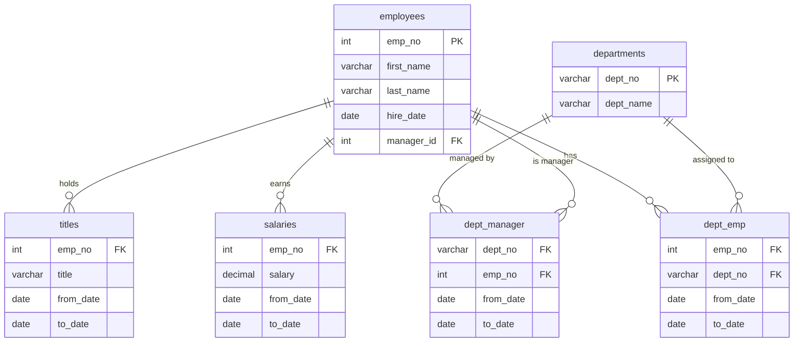

---
#== Layout
theme: default
background: https://cover.sli.dev # https://unsplash.com/collections/94734566/slidev
transition: slide-left #https://sli.dev/guide/animations#slide-transitions
mdc: true # https://sli.dev/guide/syntax#mdc-syntax
selectable: false
codeCopy: false
download: true
hideInToc: true

#== Code Highlighter
highlighter: shiki
lineNumbers: true

#== Dravings https://sli.dev/guide/drawing
drawings:
  persist: false

#== Export Configuration
# use export CLI options in camelCase format https://sli.dev/guide/exporting.html
export:
  format: pdf
  timeout: 30000
  dark: false
  withClicks: false

#== Slide Info
src: '../../pages/index.md'
title: "DB Relace"
exportFilename: "23_DB_relace"
titleTemplate: "PVA4 %s by Adam Fišer"
info: |
  ## PVA4 Programování a vývoj aplikací

  Určeno pouze pro výukové účely

  [Repository](https://github.com/OA-PVA4-Syllabus/prednasky) / [Prezentace](https://oa-pva4-syllabus.github.io/prednasky/)

  Created by [Adam Fišer](https://github.com/AdamFiser)
---
layout: default
---

#  Obsah

<Toc :columns="2" minDepth="1" maxDepth="1"></Toc>
---

# Co je relace?

- Relace je vztah mezi dvěma tabulkami
- Relace umožňuje spojovat data z různých tabulek pro efektivní práci s daty
- Vazba se vytváří pomocí klíčů:
  - Primární klíč (PK, primary key) - unikátní identifikátor záznamu
  - Cizí klíč (FK, foreign key) - odkazuje na primární klíč jiné tabulky

---

# Typy relací

- **1:1**
  - jeden záznam v jedné tabulce odpovídá jednomu záznamu v druhé tabulce
  - např. uživatel a jeho uživatelský profil
- **1:N**
  - jeden záznam v jedné tabulce odpovídá více záznamům v druhé tabulce
  - např. kategorie a produkty
- **N:M**
  - více záznamů v jedné tabulce odpovídá více záznamům v druhé tabulce
  - např. známky studentů a předmětů 
- **self-join**
  - tabulka se odkazuje sama na sebe
  - používá se pro hierarchické struktury nebo jinak propojený vztah
  - např. kategorie a nadřazená kategorie

---

# Schéma vzorové databáze




---

# `JOIN` klauzule

- `JOIN` klauzule slouží k propojení tabulek
- propojení se provádí pomocí klíčů v tabulkách anebo stejných hodnot
- typy `JOIN`:
  - `INNER JOIN` - výsledek obsahuje pouze záznamy, které mají odpovídající hodnoty v obou tabulkách
  - `LEFT JOIN` - výsledek obsahuje všechny záznamy z levé tabulky a odpovídající záznamy z pravé tabulky
  - `RIGHT JOIN` - výsledek obsahuje všechny záznamy z pravé tabulky a odpovídající záznamy z levé tabulky
  - `FULL JOIN` - výsledek obsahuje všechny záznamy z obou tabulek

---

# `INNER JOIN`

- `INNER JOIN` (průnik) vrací pouze záznamy, které mají odpovídající hodnoty v obou tabulkách

```sql
SELECT sloupec
FROM tabulka1
INNER JOIN tabulka2 ON tabulka1.sloupec = tabulka2.sloupec
```

Napřklad:
    
```sql  
SELECT 
    customers.firstName, 
    customers.lastName, 
    orders.orderDate
FROM
    customers
    INNER JOIN orders ON (customers.customerID = orders.customerID)
```

- Zobrazení seznamu všech zákazníků a jejich objednávek. Tj. jen zákazníci, kteří mají objednávku

---

# `LEFT JOIN`

- `LEFT JOIN` (levý spoj) vrací všechny záznamy z levé tabulky a odpovídající záznamy z pravé tabulky

```sql
SELECT sloupec
FROM tabulka1
LEFT JOIN tabulka2 ON tabulka1.sloupec = tabulka2.sloupec
```

Napřklad:
```sql
SELECT 
    customers.firstName, 
    customers.lastName, 
    orders.orderDate
FROM
    customers
    LEFT JOIN orders ON (customers.customerID = orders.customerID)
```
- Zobrazení seznamu všech zákazníků a pokud měli objednávku, zobrazí se i datum objednávky

---

# `RIGHT JOIN`

- `RIGHT JOIN` (pravý spoj) vrací všechny záznamy z pravé tabulky a odpovídající záznamy z levé tabulky

```sql
SELECT sloupec
FROM tabulka1
RIGHT JOIN tabulka2 ON tabulka1.sloupec = tabulka2.sloupec
```

Napřklad:
```sql
SELECT 
    customers.firstName, 
    customers.lastName, 
    orders.orderDate
FROM
    customers
    RIGHT JOIN orders ON (customers.customerID = orders.customerID)
```
- Zobrazení seznamu všech objednávek a pokud byl zákazník, zobrazí se i jeho jméno

---

# `FULL JOIN`

- `FULL JOIN` (plné spojení) vrací všechny záznamy z obou tabulek

```sql
SELECT sloupec
FROM tabulka1
FULL JOIN tabulka2 ON tabulka1.sloupec = tabulka2.sloupec
```


Například:
```sql
SELECT products.productName, categories.categoryName
FROM products
     FULL JOIN categories ON (products.categoryID = categories.categoryID)
```
- Zobrazení seznamu všech produktů a všech kategorií bez ohledu jestli má produkt kategorie anebo v kategorii není žádný produkt.

```
productName | categoryName
------------|-------------
Produkt 1   | Kategorie 1
Produkt 2   | Kategorie 2
Produkt 3   | NULL
NULL        | Kategorie 3
```

---

# Shrnutí

- Existují různé typy spojení:
  - `INNER JOIN`: Vrátí pouze ty řádky, kde existuje shoda v obou tabulkách.
  - `LEFT JOIN`: Vrátí všechny řádky z levé tabulky a odpovídající řádky z pravé tabulky. Pokud není shoda, vrací NULL.
  - `RIGHT JOIN`: Podobné jako LEFT JOIN, ale vrací všechny řádky z pravé tabulky.
  - `FULL JOIN`: Vrátí všechny řádky z obou tabulek.

---
src: '../../pages/thanku.md'
---