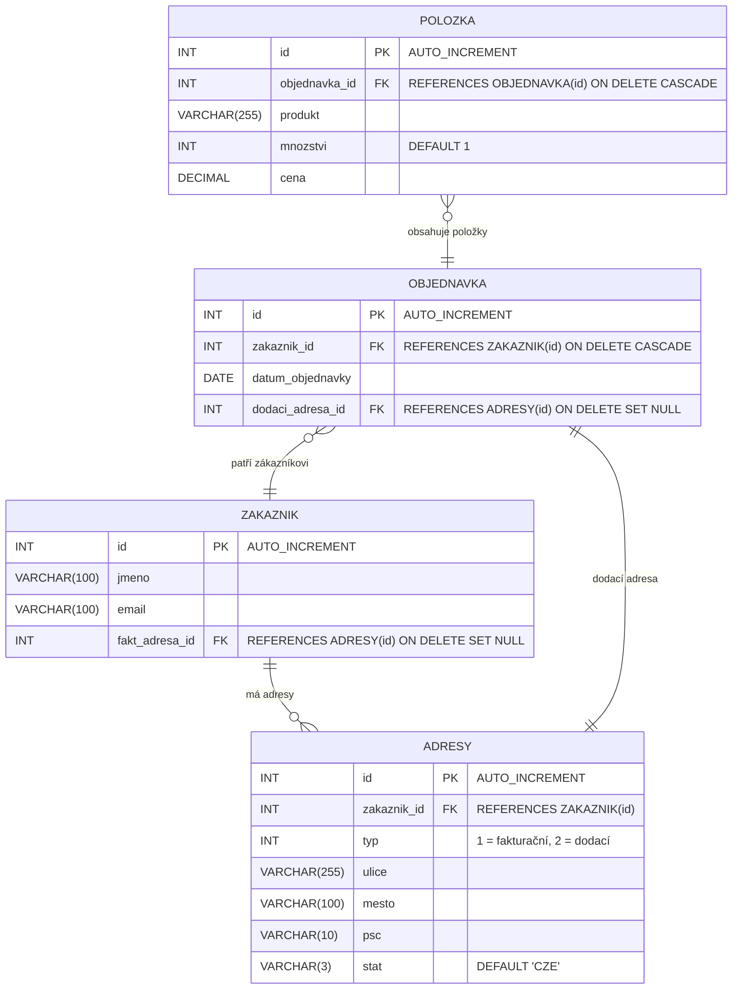

---
#== Layout
theme: default
background: https://cover.sli.dev # https://unsplash.com/collections/94734566/slidev
transition: slide-left #https://sli.dev/guide/animations#slide-transitions
mdc: true # https://sli.dev/guide/syntax#mdc-syntax
selectable: false
codeCopy: false
download: true
hideInToc: true

#== Code Highlighter
highlighter: shiki
lineNumbers: true

#== Dravings https://sli.dev/guide/drawing
drawings:
  persist: false

#== Export Configuration
# use export CLI options in camelCase format https://sli.dev/guide/exporting.html
export:
  format: pdf
  timeout: 30000
  dark: false
  withClicks: false

#== Slide Info
src: '../../pages/index.md'
title: "DB Tabulky"
exportFilename: "25_DB_tabulky"
titleTemplate: "PVA4 %s by Adam Fišer"
info: |
  ## PVA4 Programování a vývoj aplikací

  Určeno pouze pro výukové účely

  [Repository](https://github.com/OA-PVA4-Syllabus/pva4_prednasky) / [Prezentace](https://oa-pva4-syllabus.github.io/pva4_prednasky/)

  Created by [Adam Fišer](https://github.com/AdamFiser)
---
layout: default
---

#  Obsah

<Toc :columns="2" minDepth="1" maxDepth="1"></Toc>
---

# Úvod

- Porozumět základní syntaxi příkazu CREATE TABLE.
- Vytvořit tabulku s různými datovými typy.
- Použít primární a cizí klíče.
- Zabezpečit data pomocí omezení (constraints).

---

# Vytvoření tabulky

- Pro vytvoření tabulky v SQL používáme příkaz `CREATE TABLE`.
- Syntaxe příkazu:

```sql
CREATE TABLE nazev_tabulky (
    sloupec1 typ_sloupce1,
    sloupec2 typ_sloupce2,
    ...,
    klice_a_omezeni,
    ...
  );
```

```sql
CREATE TABLE zakaznik (
    cislo INT(5),
    jmeno VARCHAR(50),
    prijmeni VARCHAR(50),
    cislo_karty INT(3),
    datum_narozeni DATE
);
```

---

# Základní datové typy

- Každý sloupec má svůj datový typ.
- Některé základní datové typy:
  - `INT(n)` - celé číslo o maximální délce `n`
  - `VARCHAR(n)` - textový řetězec o maximální délce `n`
  - `DATETIME` - datum a čas případně jen `DATE` - datum nebo `TIME` - čas
  - `DECIMAL(p, s)` - desetinné číslo s celkovým počtem číslic `p` a počtem desetinných míst `s`
  - `BOOLEAN` nebo `TINYINT(1)` - logická hodnota
  - `TEXT` - textový řetězec o proměnné délce
  - `BLOB` - binární data
  - a další ...
- Velikost datového typu může být uvedena v závorce `()`. Vždy uvádíme množství očekávaných dat o řád větší. Tím si zajistíme dostatečnou rezervu pro budoucí rozšíření. Např. pro uložení dat do 1000 je potřeba `INT(4)`.

---
layout: two-cols
---

# Příklad

- Vytvoření tabulky `zakaznik` s následujícími sloupci:
  - `cislo` - celé číslo o maximální délce 5
  - `jmeno` - textový řetězec o maximální délce 50
  - `prijmeni` - textový řetězec o maximální délce 50
  - `cislo_karty` - celé číslo o maximální délce 3 tzn. očekáváme maximálně dvoumístné čísla, např. 1-99, ale máme dostatečnou rezervu pro budoucí rozšíření
  - `datum_narozeni` - datum
  - `registrace` - datum a čas

::right::

```sql
CREATE TABLE zakaznik (
    id INT PRIMARY KEY,
    jmeno VARCHAR(70),
    prijmeni VARCHAR(70),
    cislo_karty INT(3),    
    datum_narozeni DATE,
    registrace DATETIME
) ENGINE = InnoDB CHARSET = utf8mb4;
```

> Engine a charste jsou vysvětleny později v prezentaci.

---

# Výchozí hodnota

- Výchozí hodnota je hodnota, která se použije, pokud není uvedena žádná jiná hodnota.
- Uvádíme pomocí klíčového slova `DEFAULT`.
- Výchozí hodnota se použije, pokud není uvedena žádná jiná hodnota nebo je uvedena hodnota `NULL`.

Příklad s výchozí hodnotou a null
```sql
CREATE TABLE zakaznik (
    cislo INT(5),
    jmeno VARCHAR(50) NOT NULL,
    prijmeni VARCHAR(50) NOT NULL,
    islo_karty INT(3) DEFAULT NULL,
    datum_narozeni DATE DEFAULT NULL,
    registrace DATETIME NOT NULL DEFAULT CURRENT_TIMESTAMP
);
```

---

# Vložení záznamu

- Pro vložení záznamu do tabulky používáme příkaz `INSERT INTO`.
- Syntaxe příkazu:

```sql
INSERT INTO nazev_tabulky (sloupec1, sloupec2, ...)
VALUES (hodnota1, hodnota2, ...);
```

```sql
INSERT INTO zakaznik (cislo, jmeno, prijmeni, cislo_karty, datum_narozeni)
VALUES (1, 'Jan', 'Novák', 123, '2000-01-01');
```

---
layout: image-right
image: https://cover.sli.dev
---

# Rozšířené vlastnosti

---

# Primární klíč

- Primární klíč je sloupec nebo skupina sloupců, které jednoznačně identifikují každý řádek v tabulce.
- Definuje pomocí klíčového slova `PRIMARY KEY`.
- Každá tabulka může mít pouze jeden primární klíč nad jedním nebo více sloupci.
- Pokud není primární klíč definován, databáze může vytvořit implicitní primární klíč z prvního sloupce s unikátní hodnotou.
- Primární klíč může být autoinkrementovaný pomocí příkazu `AUTO_INCREMENT`

Příklad
```sql
CREATE TABLE zakaznik (
    id INT PRIMARY KEY AUTO_INCREMENT,
    jmeno VARCHAR(70),
    prijmeni VARCHAR(70),
    cislo_karty INT(3),    
    datum_narozeni DATE,
    registrace DATETIME
);
```

---
layout: two-cols
---

# Engine

- Engine je software, který řídí ukládání a vyhledávání dat v databázi.
- Uvídáme pomocí klíčového slova `ENGINE`.
- Některé základní enginy:
  - `InnoDB` - transakční engine s podporou cizích klíčů
  - `MyISAM` - starší engine s podporou fulltextového vyhledávání
  - `MEMORY` - ukládá data do paměti RAM
  - `CSV` - ukládá data do CSV souboru
  - `ARCHIVE` - ukládá data do archivu


::right::

### Příklad
```sql
CREATE TABLE zakaznik (
    cislo INT(5),
    jmeno VARCHAR(50),
    prijmeni VARCHAR(50),
    cislo_karty INT(3),
    datum_narozeni DATE,
    registrace DATETIME
) ENGINE = InnoDB;
```

---
layout: two-cols
---

# Kódování

- Kódování určuje, jak jsou data uložena v databázi.
- Uvádíme pomocí klíčového slova `CHARSET`, není-li uvedeno, použije se výchozí kódování z databáze
- Kódování může být nastaveno na úrovni databáze, tabulky nebo sloupce.
- Kódování je důležité pro podporu různých jazyků a znakových sad a to i pro ukládání speciálních znaků.
- Ovlivňuje i řazení a porovnávání textových hodnot. např.
  - `a` vs `A`,
  - `č` a `c` (ne)jsou stejné
  - Zda-li `č`, bude za `C` nebo za `Z`

::right::
- Některé základní kódování:
  - `utf8` - 8-bitové Unicode - starší verze
  - `utf8mb4` - 4-byte Unicode - novější verze, doporučená hodnota
  - `latin1` - 8-bitové kódování

--- 

# Příklad

- V tomto příkladu je kódování nastaveno na `utf8mb4`, což je doporučené kódování pro nové aplikace.
- Toto kódování podporuje 4-byte Unicode znaky, což zahrnuje i emoji a další speciální znaky.

```sql
CREATE TABLE zakaznik (
    cislo INT(5),
    jmeno VARCHAR(50),
    prijmeni VARCHAR(50),
    cislo_karty INT(3),
    datum_narozeni DATE,
    registrace DATETIME
) ENGINE = InnoDB CHARSET = utf8mb4;
```

---
layout: image-right
image: https://cover.sli.dev
---

# Omezení

---

# Omezení (Constraints)

- Omezení jsou pravidla, která definují, jaká data mohou být uložena v tabulce.
- Některé základní omezení:
    - `NOT NULL` - hodnota nesmí být `NULL`
    - `UNIQUE` - hodnota musí být unikátní
    - `CHECK` - hodnota musí splňovat podmínku
    - `DEFAULT` - výchozí hodnota
    - `FOREIGN KEY` - cizí klíč

---
layout: two-cols
---

# Cizí klíč

- Cizí klíč je sloupec nebo skupina sloupců, které odkazují na primární klíč jiné tabulky.
- Definuje pomocí klíčového slova `FOREIGN KEY`.
- Cizí klíč zajišťuje referenční integritu mezi dvěma tabulkami.
- Cizí klíč může být `NULL`, pokud není vyžadováno, aby každý řádek měl odpovídající hodnotu v primárním klíči.
- Cizí klíč může být `CASCADE`, `SET NULL`, `RESTRICT` nebo `NO ACTION` pro definování chování při změně nebo mazání primárního klíče.

::right::

### Syntaxe
```sql
FOREIGN KEY (nazev_sloupce) 
    REFERENCES nazev_tabulky(nazev_sloupce)
```

---

# Příklad

- Vytvoření tabulky `objednavka` s cizím klíčem `zakaznik_id`, který odkazuje na primární klíč `id` tabulky `zakaznik`.
```sql
CREATE TABLE objednavka (
    id INT PRIMARY KEY AUTO_INCREMENT,
    zakaznik_id INT,
    FOREIGN KEY (zakaznik_id) REFERENCES zakaznik(id)
) ENGINE = InnoDB CHARSET = utf8mb4;
```

- Pokud je smazán zákazník, smažou se i jeho objednávky.
```sql
CREATE TABLE objednavka (
    id INT PRIMARY KEY AUTO_INCREMENT,
    zakaznik_id INT,
    FOREIGN KEY (zakaznik_id) REFERENCES zakaznik(id) ON DELETE CASCADE
) ENGINE = InnoDB CHARSET = utf8mb4;
```

---
layout: two-cols
---

# Komplexnější případ



::right::

```sql {*}{maxHeight:'450px'}
-- Vytvoření tabulky zákazníků
CREATE TABLE ZAKAZNIK (
  id INT AUTO_INCREMENT PRIMARY KEY,
  jmeno VARCHAR(100) NOT NULL,
  email VARCHAR(100)
) ENGINE=InnoDB;

-- Vytvoření tabulky adres
CREATE TABLE ADRESY (
  id INT AUTO_INCREMENT PRIMARY KEY,
  zakaznik_id INT NOT NULL,
  ulice VARCHAR(255) NOT NULL,
  mesto VARCHAR(100) NOT NULL,
  psc VARCHAR(10) NOT NULL,
  stat VARCHAR(3) NOT NULL DEFAULT 'CZE',
  typ INT NOT NULL COMMENT '1 = fakturační, 2 = dodací',
  CONSTRAINT fk_zakaznik_adresa
    FOREIGN KEY (zakaznik_id)
      REFERENCES ZAKAZNIK(id)
      ON DELETE CASCADE
      ON UPDATE CASCADE
) ENGINE=InnoDB;

-- Vytvoření tabulky objednávek
CREATE TABLE OBJEDNAVKA (
  id INT AUTO_INCREMENT PRIMARY KEY,
  zakaznik_id INT NOT NULL,
  datum_objednavky DATE NOT NULL,
  dodaci_adresa_id INT,
  CONSTRAINT fk_objednavka_zakaznik
    FOREIGN KEY (zakaznik_id)
      REFERENCES ZAKAZNIK(id)
      ON DELETE CASCADE
      ON UPDATE CASCADE,
  CONSTRAINT fk_objednavka_adresa
    FOREIGN KEY (dodaci_adresa_id)
      REFERENCES ADRESY(id)
      ON DELETE SET NULL
      ON UPDATE CASCADE
) ENGINE=InnoDB;

-- Vytvoření tabulky položek objednávky
CREATE TABLE POLOZKA (
   id INT AUTO_INCREMENT PRIMARY KEY,
   objednavka_id INT NOT NULL,
   produkt VARCHAR(255) NOT NULL,
   mnozstvi INT NOT NULL DEFAULT 1,
   cena DECIMAL(10,2) NOT NULL,
   CONSTRAINT fk_polozka_objednavka
     FOREIGN KEY (objednavka_id)
       REFERENCES OBJEDNAVKA(id)
       ON DELETE CASCADE
       ON UPDATE CASCADE
) ENGINE=InnoDB;


```


---
layout: image-right
image: https://cover.sli.dev
---

# Změna tabulky

---

# Změna tabulky

- Pro změnu tabulky v SQL používáme příkaz `ALTER TABLE`.

```sql
ALTER TABLE nazev_tabulky PRIKAZ sloupec typ_sloupce;
```

### Sloupce
```sql
-- Přidání sloupce
ALTER TABLE zakaznik ADD email VARCHAR(100);

-- Změna datového typu
ALTER TABLE zakaznik MODIFY email VARCHAR(150);

-- Smazání sloupce
ALTER TABLE zakaznik DROP COLUMN email;
```

### Klíče
```sql
-- Přidání primárního klíče s autoinkrementací
ALTER TABLE zakaznik ADD id INT PRIMARY KEY AUTO_INCREMENT;

-- Přidání cizího klíče
ALTER TABLE objednavka ADD FOREIGN KEY (zakaznik_id) REFERENCES zakaznik(id);
```


---
src: '../../pages/thanku.md'
---